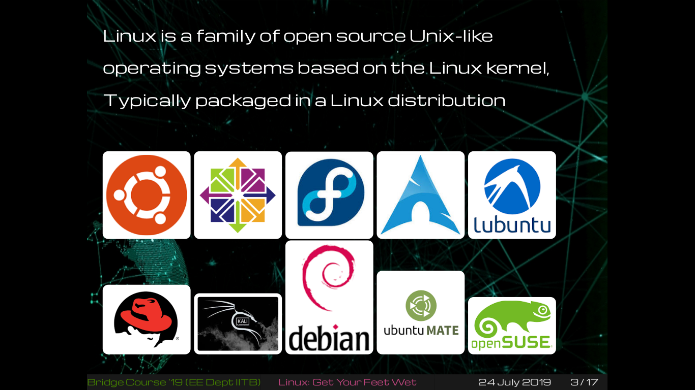

# linux-workshop
Getting started with linux . The session was held as a part of bridge course 2019.
It talks about linux basics like filesystem , io redirection, permissions, ssh etc .

PS:
Slides were made using beamer presentation in  Latex
